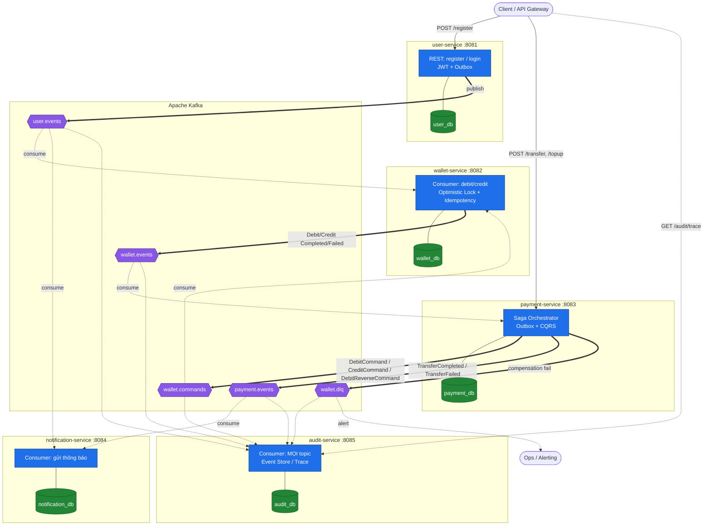
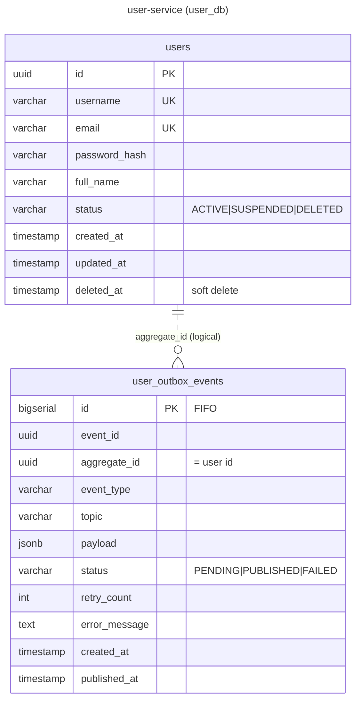
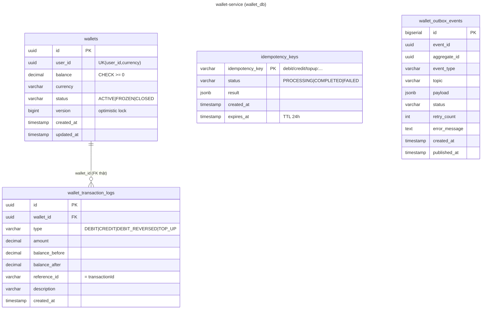
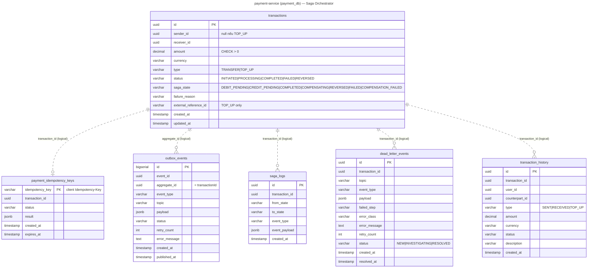
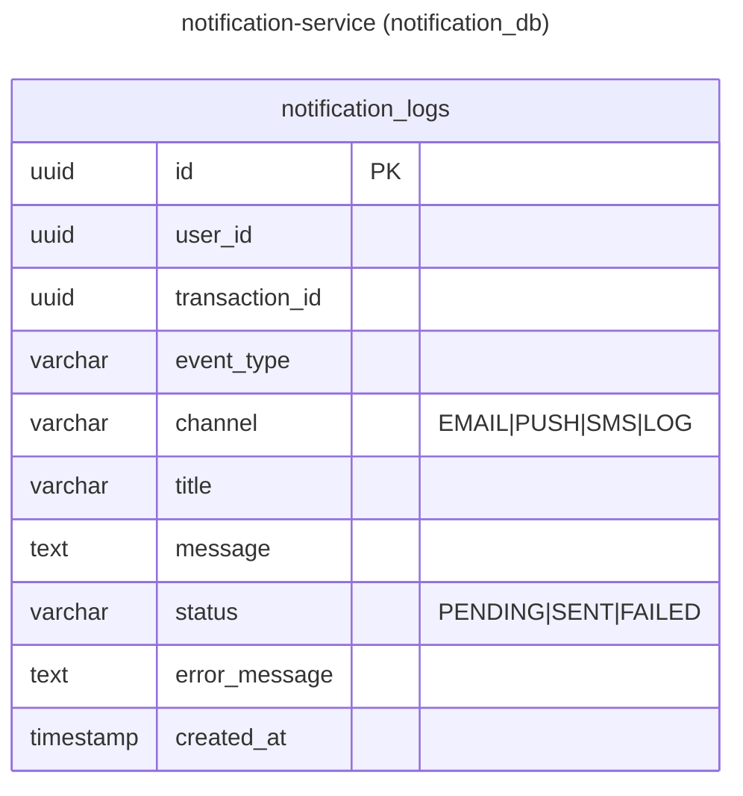
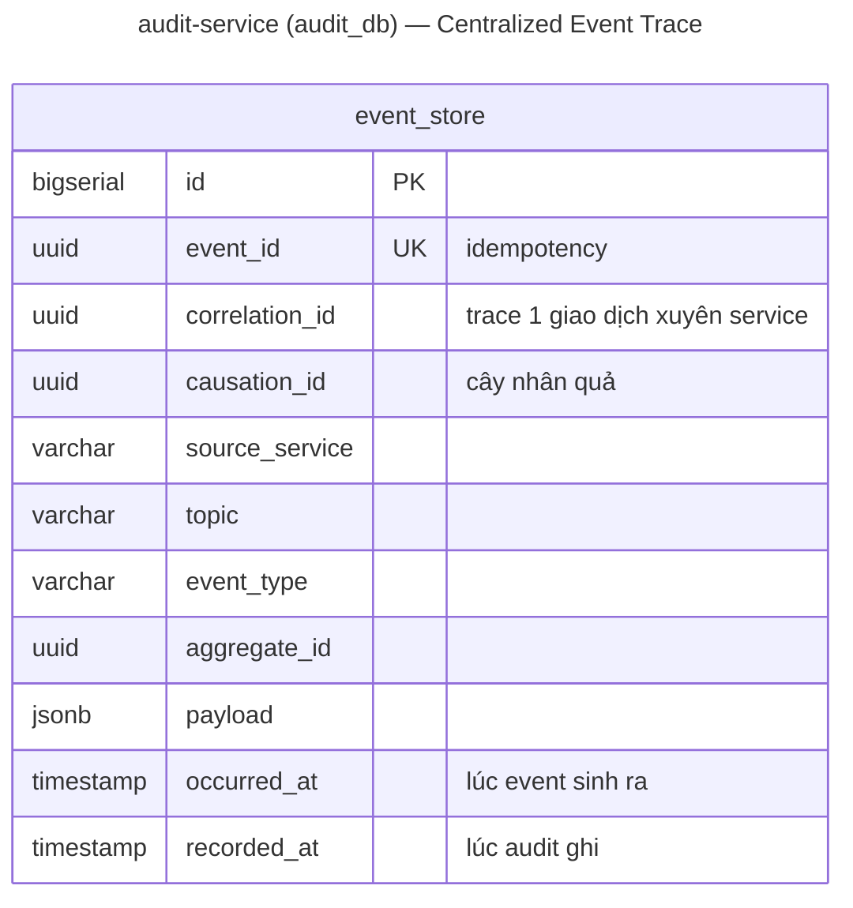
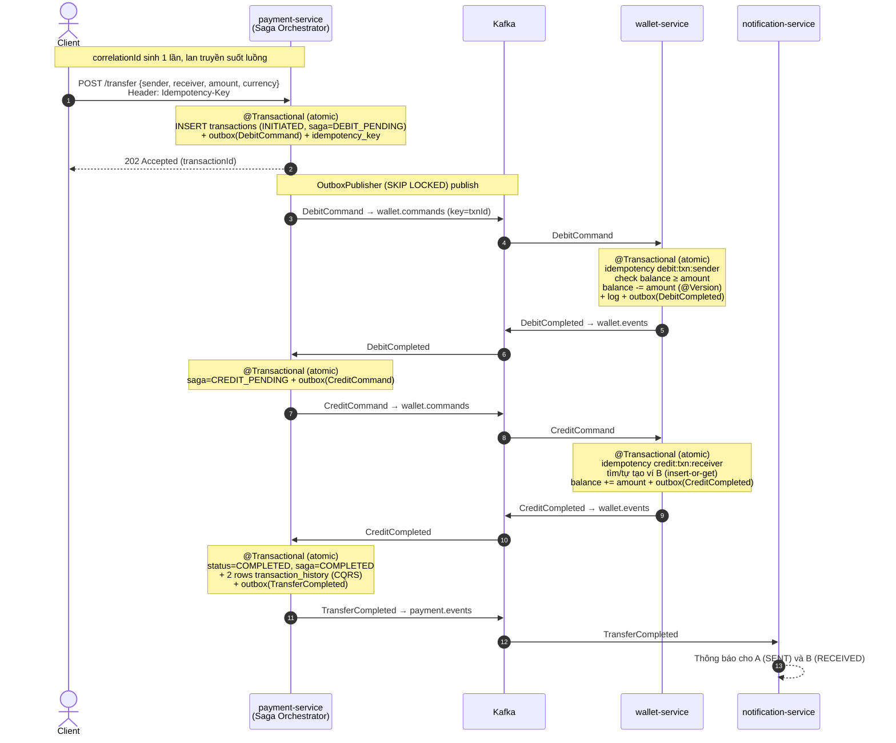

# Crypto Payment Platform — Diagrams

> Tổng hợp toàn bộ sơ đồ trực quan của hệ thống. Mỗi block `mermaid` dán được trực tiếp vào [mermaid.live](https://mermaid.live).

## Mục lục
1. [Kiến trúc tổng quan (services ↔ DB ↔ Kafka)](#1-kiến-trúc-tổng-quan)
2. [ERD từng service](#2-erd-từng-service)
   - [user-service](#21-user-service--user_db)
   - [wallet-service](#22-wallet-service--wallet_db)
   - [payment-service](#23-payment-service--payment_db)
   - [notification-service](#24-notification-service--notification_db)
   - [audit-service](#25-audit-service--audit_db)
3. [Sequence — P2P Transfer Happy Path](#3-sequence--p2p-transfer-happy-path)
4. [Sequence — Compensating Transaction (Sad Path)](#4-sequence--compensating-transaction-sad-path)

---

## 1. Kiến trúc tổng quan

- Mũi tên đậm `==>` = **publish** event lên Kafka.
- Mũi tên đứt `-.->` = **consume** event từ Kafka.
- Mỗi service có **database riêng** (database-per-service) — không truy cập chéo.
- `audit-service` hút **mọi topic** → ghi `event_store` để trace toàn hệ thống.

---

## 2. ERD từng service

> `||--o{` (nét liền) = physical FK thật (cùng 1 DB). `||..o{` (nét đứt) = quan hệ logical qua id, KHÔNG có FK (database-per-service).

### 2.1 user-service — `user_db`

### 2.2 wallet-service — `wallet_db`

### 2.3 payment-service — `payment_db`

### 2.4 notification-service — `notification_db`

### 2.5 audit-service — `audit_db`

---

## 3. Sequence — P2P Transfer Happy Path

A chuyển $500 cho B thành công. Mỗi bước của Orchestrator là **1 transaction atomic** ghi kèm outbox (Hướng A — không có state trung gian `DEBIT_COMPLETED`).

---

## 4. Sequence — Compensating Transaction (Sad Path)

Debit tiền A xong nhưng Credit cho B thất bại (ví B `FROZEN`) → phải hoàn tiền A. Khối đỏ cuối là nhánh "rollback cũng lỗi".

```mermaid
sequenceDiagram
    autonumber
    actor Client
    participant P as payment-service<br/>(Saga Orchestrator)
    participant K as Kafka
    participant W as wallet-service
    participant N as notification-service

    Client->>P: POST /transfer
    Note over P: transactions (INITIATED, saga=DEBIT_PENDING)<br/>+ outbox(DebitCommand)
    P-->>Client: 202 Accepted

    P->>K: DebitCommand → wallet.commands
    K->>W: DebitCommand
    Note over W: Trừ tiền A thành công ✅
    W->>K: DebitCompleted → wallet.events

    K->>P: DebitCompleted
    Note over P: saga=CREDIT_PENDING + outbox(CreditCommand)
    P->>K: CreditCommand → wallet.commands

    K->>W: CreditCommand
    Note over W: ❌ Ví B đang FROZEN → từ chối
    W->>K: CreditFailed → wallet.events

    K->>P: CreditFailed
    Note over P: saga=COMPENSATING<br/>+ outbox(DebitReverseCommand)
    P->>K: DebitReverseCommand → wallet.commands

    K->>W: DebitReverseCommand
    Note over W: idempotency debit-reverse:txn:sender<br/>Hoàn $500 lại ví A ✅ (retriable)
    W->>K: DebitReversed → wallet.events

    K->>P: DebitReversed
    Note over P: status=REVERSED, saga=REVERSED<br/>+ outbox(TransferFailed)
    P->>K: TransferFailed → payment.events
    K->>N: TransferFailed
    N-->>N: Báo A: "Thất bại — đã hoàn tiền"

    rect rgb(60, 20, 20)
    Note over P,W: ⚠️ Nếu DebitReverseCommand retry hết vẫn fail:<br/>saga=COMPENSATION_FAILED (status giữ PROCESSING)<br/>→ đẩy wallet.dlq + INSERT dead_letter_events + alert Ops
    end
```

