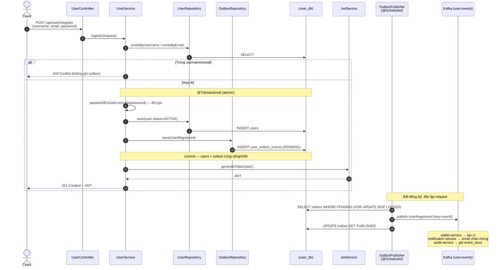
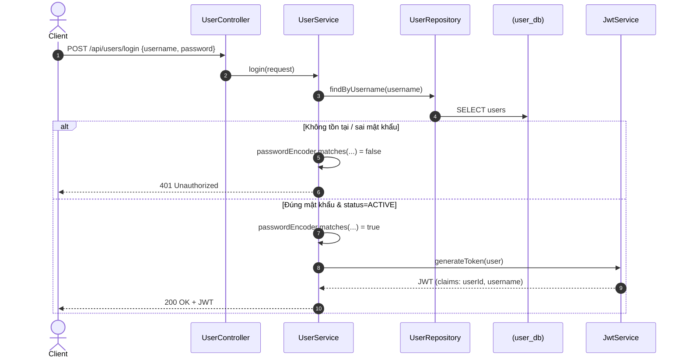
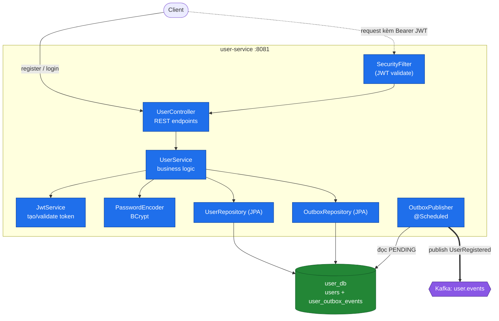

# Crypto Payment Platform — Service Flows

> Sơ đồ luồng xử lý bên trong từng service (sequence + kiến trúc phân tầng). Mỗi block `mermaid` dán được vào [mermaid.live](https://mermaid.live).

## Mục lục
1. [user-service](#1-user-service)
   - [Register](#11-register--đăng-ký--phát-userregistered-outbox)
   - [Login](#12-login--xác-thực--cấp-jwt)
   - [Kiến trúc phân tầng](#13-kiến-trúc-phân-tầng)
2. wallet-service _(sẽ bổ sung)_
3. payment-service _(sẽ bổ sung)_
4. notification-service _(sẽ bổ sung)_
5. audit-service _(sẽ bổ sung)_

---

## 1. user-service

Trách nhiệm: đăng ký, đăng nhập (JWT), phát `UserRegistered` qua Outbox. Port 8081, DB `user_db`.

### 1.1 Register — Đăng ký & phát `UserRegistered` (Outbox)

### 1.2 Login — Xác thực & cấp JWT

### 1.3 Kiến trúc phân tầng

**Điểm nhấn:**
- **Register dùng Outbox**: ghi `users` + `user_outbox_events` trong 1 transaction atomic → `UserRegistered` không mất kể cả khi Kafka down.
- **JWT trả về ngay sau đăng ký** → client dùng token gọi API tiếp theo, không cần login lại.
- **BCrypt** cho password — không lưu plaintext.
- Downstream (wallet/notification/audit) hoàn toàn bất đồng bộ — user-service chỉ phát event, không gọi REST trực tiếp.
